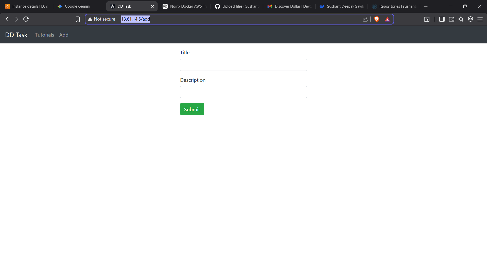

## ** Project Overview**

This project demonstrates containerization and CI/CD deployment of a full-stack CRUD application built using the **MEAN Stack**:

* **MongoDB** – Database
* **Express + Node.js** – Backend API
* **Angular 15** – Frontend UI
* **Docker & Docker Compose** – Container orchestration
* **GitHub Actions** – CI/CD pipeline
* **Docker Hub** – Image registry
* **AWS EC2 (Ubuntu)** – Cloud deployment
* **Nginx** – Reverse proxy

The application manages a collection of tutorials with the following fields:

* ID
* Title
* Description
* Published Status

Users can perform full CRUD operations and search tutorials by title.

---

## **Architecture Flow**

```
Developer Push → GitHub Repository → GitHub Actions (CI)
→ Docker Image Build → Docker Hub Registry
→ EC2 Instance Pull → Docker Compose Deployment
→ Nginx Reverse Proxy → Browser (Port 80)
```

---

## ** Local Development Setup**

### **Backend (Node.js + Express)**

```bash
cd backend
npm install
node server.js
```

MongoDB credentials can be modified in:

```
backend/app/config/db.config.js
```

---

### **Frontend (Angular 15)**

```bash
cd frontend
npm install
ng serve
```

Frontend API configuration can be modified in:

```
frontend/src/app/services/tutorial.service.ts
```

---

## **Docker Setup**

Both frontend and backend are containerized using Docker.

### **Build Images Locally**

```bash
docker build -t <dockerhub-username>/mean-frontend ./frontend
docker build -t <dockerhub-username>/mean-backend ./backend
```

---

### **Push Images to Docker Hub**

```bash
docker push <dockerhub-username>/mean-frontend
docker push <dockerhub-username>/mean-backend
```

---

## ** Cloud Deployment (AWS EC2 – Ubuntu)**

Application is deployed on an Ubuntu VM using Docker Compose.

### **Deploy Containers**

```bash
docker compose pull
docker compose up -d
```

---

## ** CI/CD Pipeline (GitHub Actions)**

The CI/CD pipeline is configured to run on:

Push to `main` branch

Pipeline steps:

1. Checkout repository
2. Login to Docker Hub
3. Build frontend & backend images
4. Push images to Docker Hub
5. SSH into EC2 instance
6. Pull latest images
7. Restart containers via Docker Compose

Workflow file location:

```
.github/workflows/docker.yml
```

---

## ** Nginx Reverse Proxy**

Nginx is configured on EC2 to expose the entire application via:

```
http://13.48.158.92
```

Routing rules:

* `/` → Frontend container
* `/api/` → Backend container

Nginx listens on **port 80**.

---

## **📸 Screenshots**

### **CI/CD Pipeline Execution**


---

### **Docker Hub Image Updates**


---

### **Running Containers on EC2**


---

### **Application UI**


---

### **Nginx** ###


## **Key DevOps Features Demonstrated**

✔ Application containerization
✔ Multi-container deployment via Docker Compose
✔ Cloud VM deployment (AWS EC2)
✔ Reverse proxy configuration (Nginx)
✔ Automated CI/CD pipeline
✔ Registry-based deployment strategy
..

